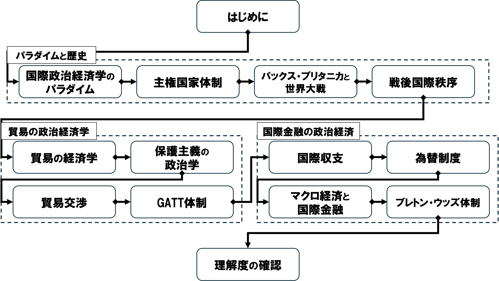

## 今日の目次

1. はじめに
1. 授業概要
1. 諸注意と評価
1. 前期期末試験の講評
1. 後期で学ぶこと
1. まとめ

# はじめに
## 授業資料と最新版シラバス
<!-- {.r-stretch .center} -->

## 本日の目的と到達目標
#### 目的
本科目の目的・計画・評価方法・諸注意を紹介し、前期「国際政治経済I」で学んだことを思い出すとともに、今学期「国際政治経済II」の目的と内容を知り、受講の意図を明確にもつ。

::: {.fragment .fade-in}
#### 到達目標
1. 本科目「国際政治経済II」の目的、進め方、評価方法を他人に説明できる。
1. 前期期末試験を振り返り、自分の理解度や課題を説明できる。
1. 後期に扱うテーマを理解し、自分の関心を言語化できる。

:::

## 担当者の自己紹介
::: {.columns}
::: {.column width=25%}

 - [[email]{.button}](mailto:jsuzuki@iss.u-tokyo.ac.jp)
 - [[webpage]{.button}](https://junpei-suzuki.github.io)
 - [[researchmap]{.button}](https://researchmap.jp/junpeisuzuki-ps)
 - [[Podcast]{.button}](https://open.spotify.com/episode/5EmfMuzgwuTSLuMblepmTp?si=_d_BnbJ-QSOIBMeldISyVg)
 
:::

::: {.column width=5%}
:::

::: {.column width=70%}
::: {.fragment .fade-in}
**鈴木淳平**（すずき・じゅんぺい）

駒澤大学法学部政治学科講師
:::

::: {.incremental}
 - 学位：早稲田大学博士（政治学）（2024年）
 - 職歴：早稲田大学助手→東京大学特任研究員→駒澤大学講師
 - 専門：先進諸国の比較政治経済学

:::

:::

:::

# 授業概要
## 授業概要
::: {.incremental}
- **越境する経済活動**と**政治**の関わりについて、国際関係論の視点から考察できる能力を身につける
- **国際政治経済学**（IPE）の研究成果から関連する**概念・理論・モデル**を学ぶ
- 第二学期では第一学期で学んだことを前提に、**グローバル化**や**安全保障**、**開発**をめぐる政治を扱う
- 講義方式によるが、**アクティブラーニング**を用いたワークを積極的に活用

:::

## 到達目標
::: {.incremental}
1. **学問領域としての国際政治経済学**を説明できる。
1. **グローバル化**や**地域統合**が各国の政治や福祉、経済運営などに与える影響について、さまざまな立場の議論を挙げ、比較検討できる。
1. **経済と安全保障との関係**について、リアリズムおよびリベラリズムそれぞれに則った代表的な理論を挙げ、説明できる。
1. **国家が経済成長を達成するために採用してきたさまざまな戦略**について、その実態を説明し、理論的に考察できる。
1. グループワークを通じて、**相互に学びの深化に貢献**できる。

:::

## 進行計画
{width=100%}

# 諸注意と評価
## 授業の進め方
::: {.incremental}
- 基本的は対面の講義方式で、スライドを使用
- 授業資料等はMoodleで共有
    - スライドのハードコピーは配布はしない予定なので、各自でダウンロードすること
- 随時アクティブラーニングも取り入れ、「聞くだけ」の授業にはしない
    - 事後学習、問いかけ、アンケート、ディスカッション⋯
 - **事後学習**⋯授業の3日後（木曜日）を締切として、オン
ラインのフォーム上でリアクションペーパー記入（合計100字程度）
   - 次回授業でなるべくフィードバック予定

:::

## 連絡方法とオフィスアワー
::: {.incremental}
- コンタクトは必ず担当者の[メールアドレス](mailto:jsuzuki@komazawa-u.ac.jp)に行うこと
    - Moodleのメッセージ機能では気づかない可能性大
- メールを送付する際は「[メールの書き方](http://www2.ipcku.kansai-u.ac.jp/~iwamoto/email.pdf)」を必ず参照し、形式やマナーを守ること
- 非常勤講師のためオフィスアワーはなし
    - 授業の前後、メール、あるいはアポによりオンラインで
対応可能

:::

## その他注意
::: {.incremental}
 - オンラインのツールを用いることがあるので、できるだけ電子機器持参
 - 授業計画は若干の変更の可能性あり
 - 同じ担当者による「国際政治経済 I」の履修が前提となっているが、必須ではない

:::

## 評価
::: {.fragment .fade-in}
**平常点**（30%）⋯事後学習のリアクションペーパー

 - 授業で学んだことと感想

:::

::: {.fragment .fade-in}
**試験**（70%）⋯期間内試験として実施

 - 選択式問題＋記述式問題
 - 各回授業の目標到達度を測定

:::

::: {.notes}
相互推薦は機能していないので廃止
:::

# 前期期末試験の講評
## 質問
7月27日に実施した試験について思い出してください。

思い出せる範囲の感覚で構いませんので、簡単だったか難しかったか、どちらでもないかを答えてください。

## 試験の結果
2026年7月27日5限実施

::: {.fragment .fade-in}
全体得点：平均57.8点、範囲32〜74点

:::

::: {.fragment .fade-in}
各問題の平均

::: {.incremental}
- 問1（選択問題）…18/20
- 問2（計算問題）…8.8/20
- 問3（記述問題・基礎）…17.3/30
- 問4（記述問題・応用）…13/30

:::
:::

## 問2 計算問題
ある期間において日本の居住者が外国の居住者と次のような取引があったとしよう。

1. 青森県の農家がドイツにりんごを3000百万円分販売。
1. 日産が中国から鉄鋼を4500百万円分購入。
1. 楽天がアメリカのAmazonに対してシステム利用権を1500百万円分で購入。
1. 日産がアメリカ市場で自動車を4600百万円分販売。
1. 武田薬品工業がイギリスのシャイアー社を2400百万円で買収。
1. KADOKAWAがアニメ作品の著作権料を750百万円分受け取り。
1. ENEOSがサウジアラビアから原油を2000百万円分購入。
1. インテルが日本企業を2800百万円分で買収。

## 答え
|     | **借方**       | **貸方**       | 
| --- | -------------- | -------------- | 
| ①  | 現預金　3000   | 輸出　3000     | 
| ②  | 輸入　4500     | 現預金　4500   | 
| ③  | 輸入　1500     | 現預金　1500   | 
| ④  | 現預金　4600   | 輸出　4600     | 
| ⑤  | 直接投資　2400 | 現預金　2400   | 
| ⑥  | 現預金　750    | 輸出　750      | 
| ⑦  | 輸入　2000     | 現預金　2000   | 
| ⑧  | 現預金　2800   | 直接投資　2800 | 

::: {.fragment .fade-in}
経常収支=金融収支=350

:::

## 問4 記述問題・応用 
比較優位モデルに基づいて、貿易が経済に与える影響を議論しなさい。（10〜15行程度）

::: {.fragment .fade-in}
採点基準：

- **モデルの主張**（8点）…モデルの主張「自由貿易は全ての国にとって利益をもたらす」が明確に書かれている。
- **貿易の開始と価格**（6点）…貿易の開始が比較優位財の相対価格を上昇させることが明確に、かつ論理的に書かれている。
- **価格と特化**（6点）…比較優位財の相対価格上昇が比較優位財への特化を引き起こすことが明確に、かつ論理的に書かれている。
- **特化と生産量**（6点）…比較優位財への特化の結果、総生産量が増えることが明確に、かつ論理的に書かれている。
- **文章の読みやすさ**（4点）…文章がかなり読みやすく書かれている。

:::

# 後期で学ぶこと
## 前期「国際政治経済I」の内容
{width=100%}

## 国際政治経済学
#### 国際政治経済学 (international political economy: IPE)
国境を超えて行われる経済活動と政治の相互作用を学ぶ学問分野

::: {.fragment .fade-in}
後期「国際政治経済II」では以下の内容を考察

::: {.incremental}
1. **グローバル化**（第2-6回）
1. **安全保障**（第7-9回）
1. **開発**（第9-13回）

:::
:::

## グローバル化
::: {.incremental}
- **グローバル化**とは何か
   - 概念化／測定
- グローバル化と**国内政治**
   - 収斂仮説／ヘクシャー＝オリーンモデル／逆第二イメージ論
- グローバル化と**福祉国家**
   - 埋め込まれた自由主義／「福祉国家の多様性」論
- グローバル化と**資本主義**
   - コーポラティズム論／「資本主義の多様性」論
- 地域統合
   - 欧州統合／欧州連合／機能主義

:::

## 安全保障
::: {.incremental}
- 経済と**安全保障**
   - エコノミック・ステートクラフト／「経済安全保障」／経済制裁
- **リアリズム**再説
   - 相対的利益論／セキュリティ外部性論
- **リベラリズム**再説
   - 民主的平和論／商業的平和論／複合的相互依存論

:::

## 開発
::: {.incremental}
- 国家の**産業政策**
   - 幼稚産業保護論／戦略的貿易理論／「強い国家」論
- 国家の**開発戦略**
   - 開発途上国／構造主義理論／輸入代替工業化
- 開発戦略の再編
   - 累積債務問題／東アジア型開発モデル／新制度学派
- **開発援助**と**国際金融**
   - 国際収支／開発金融／累積債務問題

:::

## 質問
後期の内容について、特に学びたいことや興味があることを自由に教えてください。

# まとめ
## 本日の目的と到達目標
#### 目的
本科目の目的・計画・評価方法・諸注意を紹介し、前期「国際政治経済I」で学んだことを思い出すとともに、今学期「国際政治経済II」の目的と内容を知り、受講の意図を明確にもつ。

::: {.fragment .fade-in}
#### 到達目標
1. 本科目「国際政治経済II」の目的、進め方、評価方法を他人に説明できる。
1. 前期期末試験を振り返り、自分の理解度や課題を説明できる。
1. 後期に扱うテーマを理解し、自分の関心を言語化できる。

:::

## 次回までに

#### 事後学習

 - 授業資料を見直し、目標到達をセルフチェック
 - Moodle上でのリアクションペーパー入力（木曜日まで）
    - 今回は練習なので成績評価には含めません。