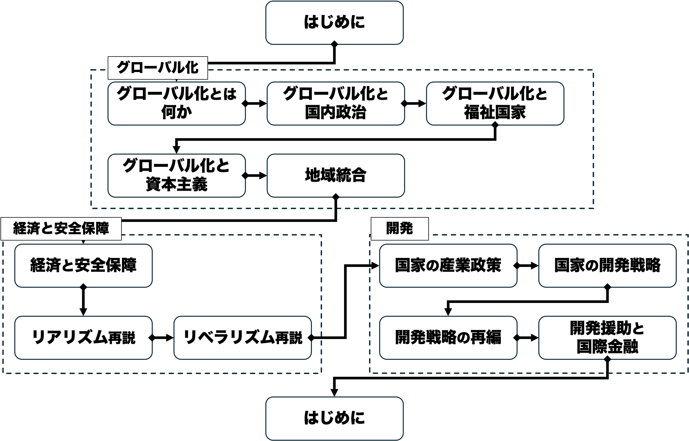
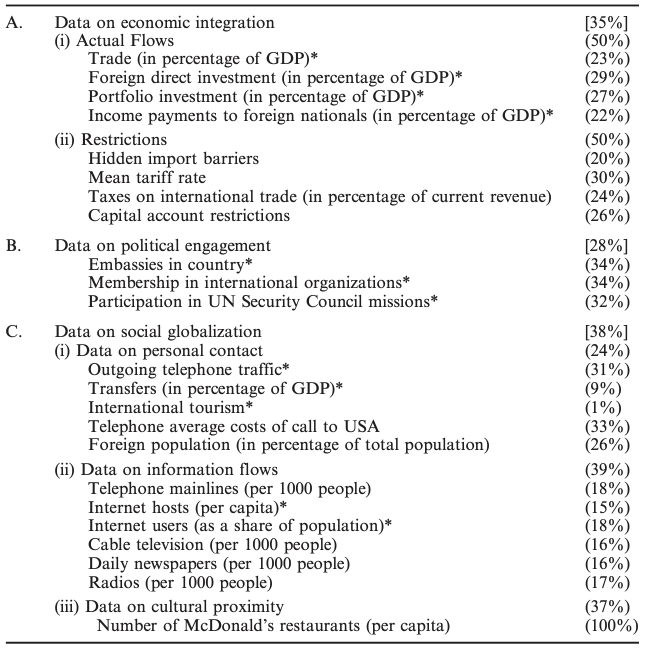
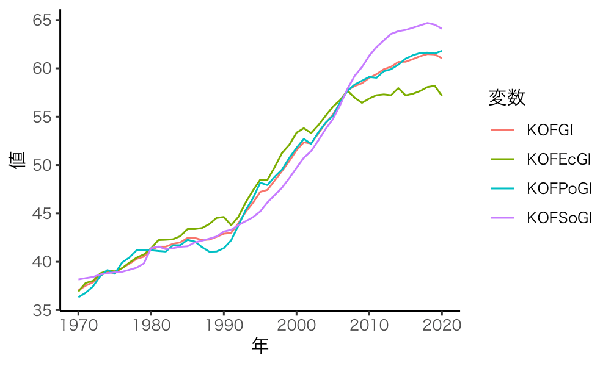
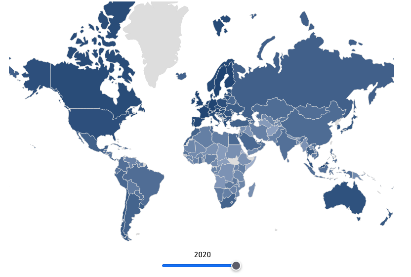

## 今日の目次

1. はじめに
1. 概念化と操作化
1. グローバル化
1. KOF Globalization Index
1. データで見るグローバル化
1. まとめ

# はじめに
::: {.notes}
目標15分
:::
## 先週のRPより
TBD

## 本日の目的と到達目標
#### 目的
抽象的な概念を定義し測定する方法を学んだ上で、国際政治経済学上の重要な概念である「グローバル化」で応用する。データに基づいてグローバル化の現状を議論する。

::: {.fragment .fade-in}
#### 到達目標
1. 概念化と操作化とは何かを説明できるようになる。
1. グローバル化を自分なりに概念化・操作化できるようになる。
1. グローバル化の指標の一つであるKOF Globalization Indexの操作化の方法を説明できるようになる。
1. KOF Globalization Idexに基づいてグローバル化の現状を描写できる。

:::

## 本日の授業の位置付け

# 概念化と操作化
## 共通理解としての概念
ある会話の例

::: {.incremental}
- A：「駅前のあのカフェで待ち合わせよう」
- B：「ああ、あそこね。いいよ。」

:::

::: {.fragment .fade-in}
「カフェ」に**共通理解**→**概念**

::: {.incremental}
- 主にコーヒーを提供
- 食事は軽めがメイン
- 比較的長く滞在可能

:::
:::

## 概念化と操作化
::: {.fragment .fade-in}
#### 概念化 (conceptualization)
抽象的な概念を成り立たせている構成要素を検討し定式化すること

:::

::: {.fragment .fade-in}
#### 操作化 (operationalization)
抽象的な概念を観察可能な変数を用いて定義し直すこと

::: {.incremental}
- **測定** (measurement) とも

:::
:::

::: {.fragment .fade-in}
例：知性

::: {.incremental}
- **概念化：**比較・抽象・概念化・判断・推理などの機能によって、感覚的所与を認識にまでつくりあげる精神的能力。（[デジタル大辞泉](https://kotobank.jp/word/%E7%9F%A5%E6%80%A7-96179)）
- **操作化：**IQテストの得点

:::
:::

## 注意点
::: {.incremental}
- 操作化の前に概念化が必要
   - 何を測っているのかを明確にする
- 概念化が違えば操作化も違う
   - 知性の概念化→無数の可能性
- 同じ概念化でも違う操作化がありうる
   - 比較の能力を測る→テスト問題は無数

:::

## Think-pair-share (10分)
- 「グローバル化」を概念化してください。
- 概念化を前提に、どのような操作化ができるか考えてみてください。

# グローバル化
## グローバル化 (globalization)
国境を超えた社会的経済的な結びつきが強くなること

::: {.fragment .fade-in}
構成要素の例：

::: {.incremental}
- 国境を超えた人の移動の活発化
- 国境を超えた経済活動の活発化
- 国境を超えた文化・政治交流の活発化

:::
:::

## 質問
「移民」の数を測るためには移民と見做される人を特定しなければ意いけません。

どのような人が移民だと思いますか？

## 移民の概念化と操作化
::: {.fragment .fade-in}
#### 辞書的定義（概念化）
個人あるいは集団が**永住**を望んで他の国に移り住むこと。また、その人々。（[デジタル大辞泉](https://kotobank.jp/word/%E7%A7%BB%E6%B0%91-32276)）

::: {.incremental}
- 長期的な移動が想定されており、短期的な旅行者は含まない。

:::
:::

::: {.fragment .fade-in}
#### 操作的定義
平常の居所（usual residence）以外の国に最低一年（12ヶ月）以上移り住んだ人（UN DESA 1998）

:::

## 移民の数
](figs/migration.png)

## 貿易開放性と海外直接投資
::: {.fragment .fade-in}
#### 貿易開放性 (trade openness)
$$
貿易開放性 = \frac{輸入額+輸出額}{国内総生産} \times 100
$$

:::

::: {.fragment .fade-in}
#### 海外直接投資 (Foreign Direct Investment: FDI)
外国にある企業の経営を掌握ないしそれに影響を与える目的で行われる投資

::: {.incremental}
- 議決権付き株式の10%を超える購入

:::
:::

---
::: {.panel-tabset}
#### 貿易開放性
<!-- ](figs/trade-openness.png) -->

<iframe src="https://ourworldindata.org/grapher/trade-as-share-of-gdp?tab=line&country=~OWID_WRL" loading="lazy" style="width: 100%; height: 600px; border: 0px none;" allow="web-share; clipboard-write"></iframe>

#### 海外直接投資
<!-- ](figs/fdi.png) -->

<iframe src="https://data.worldbank.org/share/widget?indicators=BX.KLT.DINV.CD.WD" width='900' height='600' frameBorder='0' scrolling="no" ></iframe>

:::

# KOF Globalization Index
## KOF Globalization Index
チューリヒ工科大学経済研究所（[ETH Zurich KOF](https://kof.ethz.ch/en/forecasts-and-indicators/indicators/kof-globalisation-index.html)）が提供[^dreher2006]

::: {.fragment .fade-in}
3つの次元でグローバル化の程度を包括的・定量的に測定

::: {.incremental}
- **経済**のグローバル化…モノ・資本・サービス、市場交換に関する情報・認識の長距離移動
- **政治**のグローバル化…政府の政策の拡散 
- **社会**のグローバル化…アイデア、情報、イメージ、人々の移動

:::
:::

[^dreher2006]: Dreher, A. (2006). Does globalization affect growth? Evidence from a new index of globalization. *Applied Economics,* 38(10), 1091-1110. 

## 質問
経済・政治・社会の各三次元を測定するのにKOFはどのようなデータを使っていると思いますか？

## 経済のグローバル化
実際のフローの量：

::: {.incremental}
- 貿易（対GDP比）
- 海外直接投資（対GDP比）
- ポートフォリオ投資（対GDP比）
- 外国籍の市民及び企業に対する所得の支払い（対GDP比）

:::

::: {.fragment .fade-in}
貿易・資本移動に対する規制：

::: {.incremental}
- 非関税障壁
- 平均関税率
- 国際貿易にかかる税（対総税収比）
- 資本規制指標

:::
:::

## 政治のグローバル化
::: {.incremental}
- 外国大使館の数
- 国際機関の加盟数
- 国連安保理ミッションの参加数

:::

## 社会のグローバル化
個人的接触

::: {.incremental}
- 外国への電話トラフィック
- 海外観光者数
- 外国生まれ人口etc

:::

::: {.fragment .fade-in}
情報の伝播

::: {.incremental}
- 電話回線数
- インターネットホスト／利用者数
- 日刊新聞数etc.

:::
:::

::: {.fragment .fade-in}
文化的近接性

::: {.incremental}
- マクドナルド店舗数（一人当たり）

:::
:::

## 

{.r-stretch}

# データで見るグローバル化
## KOF Indexの外観
::: {.panel-tabset}
#### トレンド

#### 国別比較

:::

# まとめ
## 本日の目的と到達目標
#### 目的
抽象的な概念を定義し測定する方法を学んだ上で、国際政治経済学上の重要な概念である「グローバル化」で応用する。データに基づいてグローバル化の現状を議論する。

::: {.fragment .fade-in}
#### 到達目標
1. 概念化と操作化とは何かを説明できるようになる。
1. グローバル化を自分なりに概念化・操作化できるようになる。
1. グローバル化の指標の一つであるKOF Globalization Indexの操作化の方法を説明できるようになる。
1. KOF Globalization Idexに基づいてグローバル化の現状を描写できる。

:::

## 次回までに
#### 事後学習

 - 授業資料を見直し、目標到達をセルフチェック
 - Moodle上でのリアクションペーパー入力（木曜日まで）