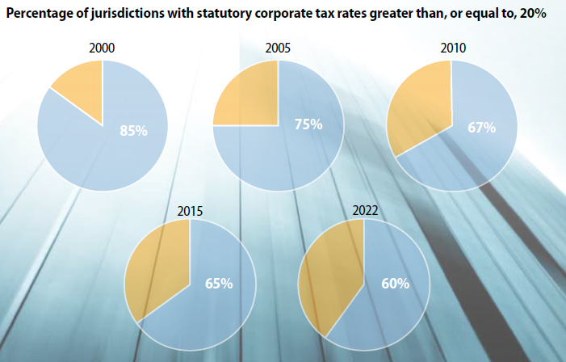

## 今日の目次

1. はじめに
1. 収斂仮説
1. 復習：ヘクシャー＝オリーンモデル
1. 階級間連合モデル
1. 三つのイメージ論
1. まとめ

# はじめに
::: {.notes}
目標15分
:::
## 先週のRPより
TBD

## 本日の目的と到達目標
#### 目的
グローバル化が国内政治経済に与える影響について収斂仮説を学ぶとともに、ヘクシャー＝オリーンモデルに基づいて収斂仮説を批判的に検討する。

::: {.fragment .fade-in}
#### 到達目標
1. 「収斂仮説」とは何かを説明できる。
1. ヘクシャー＝オリーンモデルに基づいて貿易の経済的な影響を議論できる。
1. ヘクシャー＝オリーンモデルに基づいて収斂仮説を批判できる。
1. 国際政治の「三つのイメージ」と「逆第二イメージ論」を説明できる

:::

## 本日の授業の位置付け

# 収斂仮説
## （復習）KOF Indexのトレンド

::: {.notes}
KOF Indexのトレンド

- 総合、経済、政治、社会の3つ
- いずれも増え続けている
- ただし2008年ごろに分岐
  - 経済指標は伸び悩み
  - 社会指標は急速に伸び
  - 政治と総合は平均的
  
:::

## 収斂仮説 (convergence thesis)
::: {}
グローバル化は各国の政治経済のあり方を均質化させるという仮説

:::

::: {.fragment .fade-in}
::: {.colmuns}
::: {.column width=70%}
> グローバル化の特徴は、政治経済が「**黄金の拘束衣**」を着るということである。…きつく締めればそれだけ多くの黄金が生まれる。
:::

::: {.column width=30%}

:::

:::

:::

## 世界の法人税率
{.r-stretch}

::: {.fragment .fade-in}
Q. この現象の背景にある理由は？

:::

::: {.notes}
法人税率下落の理由

- グローバル化で企業が移動可能
- 高い法人税率→企業の逃避
- 悪影響（税収や雇用の減少）
:::

# 復習：ヘクシャー＝オリーンモデル
## クイズ
以下のうち、HO モデルに基づいているのはどれでしょうか。当てはまるものをすべて選んでください。

1. 貿易を自由化し各国が比較優位を持つ財に特化することは利益だけをもたらす。
1. 貿易が自由化されても、要素は産業間で移動できないため、輸出産業に関わる要素が得をし、輸入競合産業に関わる要素が損をする。
1. 各国は、自国で相対的に豊富な生産要素を多く使う財を輸出し、希少な要素を多く使う財を輸入する。
1. 貿易が自由化されると、その国に豊富な生産要素にとって有利になり、希少な生産要素は不利になる。

## ヘクシャー＝オリーンモデル
::: {.columns}

::: {.column width=70%}
**エリ・ヘクシャー**と**ベルティル・オリーン**が考案

::: {.fragment .fade-in}
主張「貿易は全体的には得だが、**不平等な所得分配**を生み出す」

::: {.incremental}
- 全ての生産要素は**長期的には移動可能**
- 財の生産に使う生産要素の配合に違い
- 生産要素賦存→貿易パターン
- 貿易の開始→所得格差の発生
   - 豊富生産要素と希少生産要素

:::
:::
:::

::: {.column width=30%}

:::

:::

## 2-2-2モデル
::: {.fragment .fade-in}
国：**ドイツ**と**フランス**
:::

::: {.fragment .fade-in}
財：**布**と**食品**
:::

::: {.fragment .fade-in}
生産要素：**労働**、**資本**

:::

::: {.fragment .fade-in}
|            |                |            | 
| ---------- | -------------- | ---------- | 
| **布**     | **労働集約財** | 労働＞資本 | 
| **資本**   | **資本集約財** | 労働＜資本 | 

:::

::: {.fragment .fade-in}
**集約性**…相対的にどちらの生産要素を使うか

:::

::: {.fragment .fade-in}
#### 生産要素賦存 (factor endowment)
相対的にどちらの生産要素が豊富か

::: {.incremental}
- ドイツ…労働が豊富→布が得意
- フランス…資本が豊富→食品が得意

:::
:::

## 貿易の開始
貿易を開始すると…

::: {.incremental}
- ドイツ…布に比較優位→相対価格の増加→布の輸出
- フランス…食品に比較優位→相対価格の増加→食品の輸出
:::

::: {.fragment .fade-in}
リカードモデルの特化と同様→総生産量の増加
:::

::: {.fragment .fade-in}
#### ヘクシャー＝オリーン定理
各国は自国に**豊富**な生産要素を集約的に用いる財を**輸出**し、**希少**な生産要素を集約的に用いる財を**輸入**する

:::

## 特化の影響

::: {.incremental}
- ドイツ…布への特化→労働需要の増加→賃金上昇
- フランス…食品への特化→資本需要の増加→利子上昇

:::

::: {.fragment .fade-in}
#### ストルパー＝サミュエルソン定理
貿易の開始は、各国に**豊富**にある生産要素の価格を**上昇**させる一方**希少**な生産要素の価格を**下落**させる
:::

# 階級間連合モデル
## ロゴウスキーの分析[^rogowski1989]
::: {.colmuns}
::: {.column width=80%}
SS定理を応用し貿易をめぐる階級間連合形成を分析

::: {.fragment .fade-in}
グローバル化に対する態度の多様性を示唆

::: {.incremental}
- SS定理→各国で自由貿易を好む／反対する層は異なる
- 自由貿易を好む／反対する層同士で異なった連合

:::
:::
:::

::: {.column width=20%}
{.r-stretch}
:::

:::

[^rogowski1989]: Rogowski, R. (1989). *Commerce and Coalitions: How Trade Affects Domestic Political Alignments.* Princeton University Press.

## ロゴウスキーの設定
19世紀の**2国3要素**モデル

::: {.fragment .fade-in}
|              | 土地 | 資本 | 労働 | 
| ------------ | ---- | ---- | ---- | 
| **アメリカ** | ◯   | ×    | △   | 
| **ドイツ**   | △   | ×    | ◯   | 

:::

::: {.fragment .fade-in}
#### クイズ
SS定理に基づくと、それぞれの国の地主・資本家・労働者は自由貿易からどのような利益を受け取るでしょうか。利益の大きさの順番に並び替えてください。

:::

## 階級間連合形成
::: {.fragment .fade-in}
|              | 自由貿易派 | 保護主義派     | 
| ------------ | ---------- | -------------- | 
| **アメリカ** | 地主       | 資本家・労働者 | 
| **ドイツ**   | 労働者     | 地主・資本家   | 

:::

::: {.fragment .fade-in}
具体的には…

::: {.incremental}
- アメリカ…**南北戦争**に至る対立
   - 南部奴隷農場主vs.北部資本家
- ドイツ…**ビスマルク保護関税法**
   - ユンカーと資本家の連合による圧力

:::
:::

# 三つのイメージ論
## 三つのイメージ論
::: {.columns}
::: {.column width=70%}
**ケネス・ウォルツ**が国際関係をめぐる議論を3つに分類

::: {.incremental}
1. **第一イメージ論**…**特定の人物**に着目した議論
   - 例：「ヒトラーの野望が第二次大戦に」
1. **第二イメージ論**…**国家の属性**の着目した議論
   - 例：「民主主義国家は戦争をしにくい」
1. **第三イメージ論**…**国際政治の構造**そのものに着目した議論
   - 例：「アナーキーな国際関係では対立は不可避」

:::

:::

::: {.column width=30%}

:::

:::

## Think-pair-share
1. リアリズムで学んだ覇権安定理論は、三つのイメージのうちどれに位置付けられるでしょうか。
1. ロゴウスキーの議論は三つのイメージのうちどれに位置付けられる／どれに一番近いでしょうか。

## 逆第二イメージ論
::: {.columns}
::: {.column width=70%}
**ピーター・ゴーヴィッチ**の提唱[^gourevitch1978]

::: {.incremental}
- 第二イメージ論⋯国家の属性→国際関係上の現象
- **逆**第二イメージ論⋯国際関係上の現象→国家の属性
- ロゴウスキー「貿易→国家内の階級間連合」

:::
:::

::: {.column width=30%}

:::

:::

[^gourevitch1978]: Gourevitch, P. (1978). The second image reversed: the international sources of domestic politics. \textit{International Organization,} 32(4), 881-912.\

# まとめ
## 本日の目的と到達目標
#### 目的
グローバル化が国内政治経済に与える影響について収斂仮説を学ぶとともに、ヘクシャー＝オリーンモデルに基づいて収斂仮説を批判的に検討する。

::: {.fragment .fade-in}
#### 到達目標
1. 「収斂仮説」とは何かを説明できる。
1. ヘクシャー＝オリーンモデルに基づいて貿易の経済的な影響を議論できる。
1. ヘクシャー＝オリーンモデルに基づいて収斂仮説を批判できる。
1. 国際政治の「三つのイメージ」と「逆第二イメージ論」を説明できる

:::

## 次回までに
#### 事後学習

 - 授業資料を見直し、目標到達をセルフチェック
 - Moodle上でのリアクションペーパー入力（木曜日まで）
