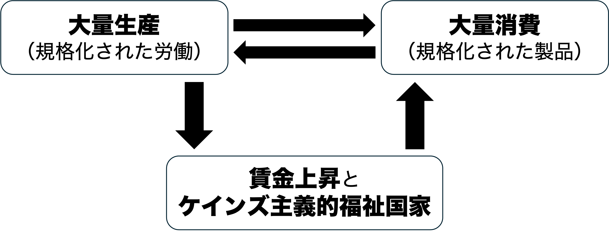
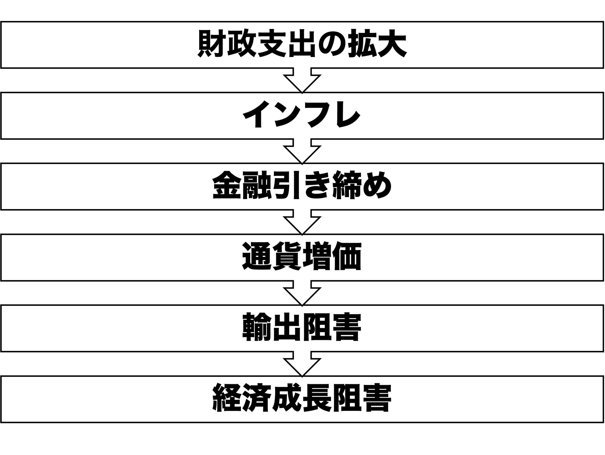
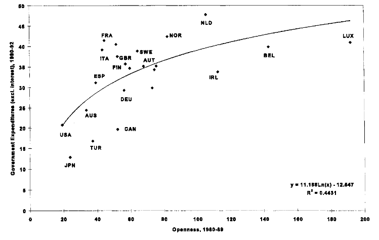

## 今日の目次

1. はじめに
1. 戦後政治経済と福祉国家
1. ケインズ経済学と福祉国家
1. 福祉国家の多様性
1. グローバル化と福祉国家
1. まとめ

# はじめに
::: {.notes}
目標15分
:::
## 先週のRPより
TBD

## 本日の目的と到達目標 {.smaller}
#### 目的
戦後福祉国家の成立と多様性について、「埋め込まれた自由主義」と「福祉国家の多様性」の議論を復習・学習するとともに、グローバル化が福祉国家に与える影響を検討する。戦後体制やケインズ主義における福祉国家の役割を確認した上で、グローバル化が福祉国家を弱体化させるのか、それとも強化するのかを考察する。

::: {.fragment .fade-in}
#### 到達目標
1. 戦後福祉国家が成立するまでの過程と戦後政治経済体制のありようを説明できる。
1. 福祉国家の理論的背景となっているケインズ経済学を説明できる。
1. エスピン＝アンデルセンの議論に基づいて、福祉国家のありようを3つに分類できる。
1. 「収斂仮説」および「補償仮説」に基づいて、グローバル化が福祉国家に与える影響を予想できる。る

:::

## 本日の授業の位置付け

# 戦後政治経済と福祉国家
## 質問
前期に埋め込まれた自由主義について学びましたが、これはどういう考え方でしたでしょうか

## 埋め込まれた自由主義
#### embedded liberalism
**自由貿易**と**国家の自律性**のバランスを追求した戦後体制の原則

::: {.incremental}
- 国際的には**セーフガード**、**資本移動規制**
- 国内的には**ケインズ主義的福祉国家**

:::

## 福祉国家の成立過程
::: {.incremental}
1. エリザベス救貧法 (1601）…**慈善**としての福祉
   - 労働拒否者の処罰と不能者の保護・就労支援
   - 主たる市場を残余的に支える福祉
1. ビスマルク型福祉国家…**秩序維持**としての福祉
   - 「飴と鞭」…社会主義勢力の抑圧と懐柔
   - 職域別に整備された雇用保障
1. ナショナル・ミニマム…**権利**としての福祉
   - 例：ニューディール、べヴァレッジ報告
   - すべての人を包括する公的医療保険制度
   - 理論的背景としての**ケインズ主義的福祉国家**

:::

## 生産性の政治 (politics of productivity)
生産性の向上や経済成長を共通目的とする戦後政治の合意

::: {.fragment .fade-in}

:::

::: {.fragment .fade-in}
**戦後労使和解体制**…パイを大きくして再分配をめぐる争いを回避
:::

## 戦後の社会支出と経済成長
::: {.panel-tabset}
#### 社会支出
<iframe src="https://ourworldindata.org/grapher/social-spending-oecd-longrun?time=1960..latest&country=CAN~JPN~USA~ITA~DEU~FRA~GBR&tab=line" loading="lazy" style="width: 100%; height: 600px; border: 0px none;" allow="web-share; clipboard-write"></iframe>

#### 経済成長
<iframe src="https://archive.ourworldindata.org/20260909-233456/grapher/gdp-per-capita-penn-world-table.html?tab=line&country=USA~DEU~GBR~JPN~FRA~ITA~CAN" loading="lazy" style="width: 100%; height: 600px; border: 0px none;" allow="web-share; clipboard-write"></iframe>

:::

# ケインズ経済学と福祉国家
## 古典派経済学 (classical economics)
::: {.columns}
::: {.column width=70%}
18世紀後半から19世紀前半にかけてイギリスに登場した経済学の考え方

::: {.incremental}
- アダム・スミス、トマス・ロバート・マルサス、デイヴィッド・リカード
- 基本的には市場の**自由放任**を主張

:::

::: {.fragment .fade-in}
世界恐慌の分析

::: {.incremental}
- 高失業←高い賃金が企業の労働需要を減退
- 賃金が下がるまで待てば良い

:::

:::

:::

::: {.column width=5%}

:::

::: {.column width=25%}

:::

:::

::: {.notes}
世界恐慌の時のアメリカの失業率は23%
:::

## ケインズ主義経済学 
#### Keynesian economics
::: {style="font-size: 0.9em;"}
::: {.columns}
::: {.column width=70%}
**ジョン・メイナード・ケインズ**に始まる経済学

::: {.fragment .fade-in}
古典派批判「価格は伸縮的でない」

::: {.incremental}
- 賃金の**下方硬直性**…一回上がったら下がりにくい

:::

:::

::: {.fragment .fade-in}
#### 有効需要 (effective demands)
貨幣の裏付けのある需要

::: {.incremental}
- **非自発的失業**…労働需要の不足による失業
:::

:::

::: {.fragment .fade-in}
政府の積極的役割が推奨（**マクロ経済政策**）

::: {.incremental}
- 金融緩和と財政出動
- ニューディール、ベヴァレッジ報告→福祉国家

:::
:::

:::

::: {.column width=5%}

:::

::: {.column width=25%}
.jpg)
:::
:::
:::

## クイズ
以下の文章のうち、正しいものをすべて選びなさい。

1. ケインズは、不況時においては価格の下落によって需要が回復すると主張した。
1. 「有効需要」とは、実際に貨幣の裏付けがあり、支出される可能性のある需要を指す。
1. ケインズ経済学では、政府の財政出動によって総需要を刺激できると考えた。
1. 古典派経済学によれば、価格や賃金が柔軟に動くため、失業は一時的な現象にすぎない。

# 福祉国家の多様性
## 『福祉資本主義の三つの世界』
::: {.columns}
::: {.column width=70%}
以下の観点に基づき主要国の福祉国家のありかたを3つに分類[^espingandersen1990]

::: {.incremental}
- **脱商品化**…人々が市場に依存せずに生活できる程度
- **階層化**…異なった階層の間での格差の程度
- **脱家族化**…人々が家族に依存せずに生活できる程度

:::

:::

::: {.column width=30%}
](https://m.media-amazon.com/images/I/81HK9BoH6BL.jpg)
:::

:::

[^espingandersen1990]: Esping-Andersen, G. (1990). The Three Worlds of Welfare Capitalism. Polity Press. 

## 3つの分類
::: {style="font-size: 75%;"}
|              | 社民主義                         | 保守主義                   | 自由主義                   | 
| ------------ | -------------------------------- | -------------------------- | -------------------------- | 
| **国・地域** | 北欧諸国 （スウェーデンなど） | 大陸欧州 （ドイツなど） | 英語圏 （アメリカなど） | 
| **脱商品化** | 高                               | 高                         | 低                         | 
| **階層化**   | 低                               | 高                         | 高                         | 
| **脱家族化** | 高                               | 低                         | 中                         | 
| **主導勢力** | 労働組合・社民政党               | 教会・保守主義勢力         | 資本家                     | 

:::

::: {.notes}
**社民主義モデル**

- 北欧の福祉国家
- 高い脱商品化…高い水準の福祉給付
- 低い階層化…幅広い人々への平等な給
  - cf.一元的年金制度
- 高い脱家族化…女性の自立支援
  - 子育て支援と公共セクターでの女性雇用
- 強力な労働組合と社民政党の主導

**保守主義モデル**

- 大陸ヨーロッパ諸国の福祉国家
- 高い脱商品化…高い水準の福祉給付
- 高い階層化…水準の異なる複数の給付
- 低い脱家族化…男性稼得者モデルへの依存
- カトリック教会や保守主義勢力の主
  - 教皇レオ13世回勅「Rerum Novarum」(1893）→キリスト教民主主義

**自由主義モデル**

- アングロ・サクソン諸国の福祉国家
-  低い脱商品化…低い福祉給付水準
- 高い階層化…貧しい人々のみへの給付
- 中程度の脱家族化…市場に任せて積極的には対応せず
- 資本家など自由主義勢力の主導
  - cf.エリザベス救貧法

:::

## キリスト教民主主義
::: {.columns}
::: {.column width=70%}
**教皇レオ13世**回勅「Rerum Novarum」

::: {.fragment .fade-in}
::: {style="font-size: 75%;"}

> …現在激化している対立の要因は、産業活動の広範な拡大や科学の驚異的な発見、雇用主と労働者の関係の変化、ごく少数の個人による莫大な富と大衆の極度の貧困、労働者階級の自立心の増大と相互連帯の強化…

> …狡猾な扇動者たちが、こうした意見の相違を利用して人々の判断を歪め、民衆を反乱へと駆り立てようと企んでいる…

> いずれにせよ、労働者階級の大半を不当に苦しめている悲惨な状況に対して、早急に適切な救済策を見出さなければならない…

:::
:::

:::

::: {.column width=30%}

:::

:::

## Think-pair-share (10分)
このエスピン＝アンデルセンの分類の中で、日本はどのモデルに一番近いと思いますか？

::: {.notes}
日本の位置付けは不明瞭

- 保守主義と自由主義の組み合わせ？
  - 低い脱商品化
  - 高い階層化
  - 低い脱家族化
- 東アジアにおける家族主義モデル？

:::

# グローバル化と福祉国家
## 質問
先週学んだ収斂仮説について思い出してください。

収斂仮説に基づくと、福祉国家のあり方はどのようになると思いますか？

## 収斂仮説
グローバル化は各国の政治経済のあり方を均質化させる

::: {.incremental}
- 資本の流動化の影響
   - 資本が国家や労働者に対して強い交渉力
   - 労働者保護の撤廃や労働条件の悪化
- **マンデル＝フレミングモデル**「開放経済下では財政政策の効果消滅」
   - 経済成長を狙った財政出動が逆効果

:::

::: {.fragment .fade-in}
予測「自由主義モデルへの収斂」

:::

## マンデル＝フレミングモデル

{.r-stretch}

::: {.notes}
- 財政支出の拡大はインフレをもたらす
- インフレに対して中央銀行は金融引き締め
- 金融引き締めで利子率が上がると通貨増価
- 通貨増価では輸出に不利
- 結果、経済成長が阻害

:::

## 補償仮説
グローバル化は福祉国家を解体するのではなくその存立基盤を強化するという仮説

::: {.incremental}
- 福祉が発達した北欧は国際貿易に強く依存する小国であるという観察（**小国仮説**）を一般化
   - 小さい国内市場→国際貿易に依存
   - 外国からのショックに脆弱→福祉政策への需要が大
- グローバル化はどの国も小国にすることを意味するから、ショック緩和として福祉が整備されるようになる

:::

## 貿易開放性と政府支出[^rodrik1998]
{width=80%}

[^rodrik1998]: Rodrik, D. (1998). Why do more open economies have bigger governments? *Journal of Political Economy, 106*(5), 997-1032. 

# まとめ
## 本日の目的と到達目標 {.smaller}
#### 目的
戦後福祉国家の成立と多様性について、「埋め込まれた自由主義」と「福祉国家の多様性」の議論を復習・学習するとともに、グローバル化が福祉国家に与える影響を検討する。戦後体制やケインズ主義における福祉国家の役割を確認した上で、グローバル化が福祉国家を弱体化させるのか、それとも強化するのかを考察する。

::: {.fragment .fade-in}
#### 到達目標
1. 戦後福祉国家が成立するまでの過程と戦後政治経済体制のありようを説明できる。
1. 福祉国家の理論的背景となっているケインズ経済学を説明できる。
1. エスピン＝アンデルセンの議論に基づいて、福祉国家のありようを3つに分類できる。
1. 「収斂仮説」および「補償仮説」に基づいて、グローバル化が福祉国家に与える影響を予想できる。る

:::

## 次回までに
#### 事後学習

 - 授業資料を見直し、目標到達をセルフチェック
 - Moodle上でのリアクションペーパー入力（木曜日まで）