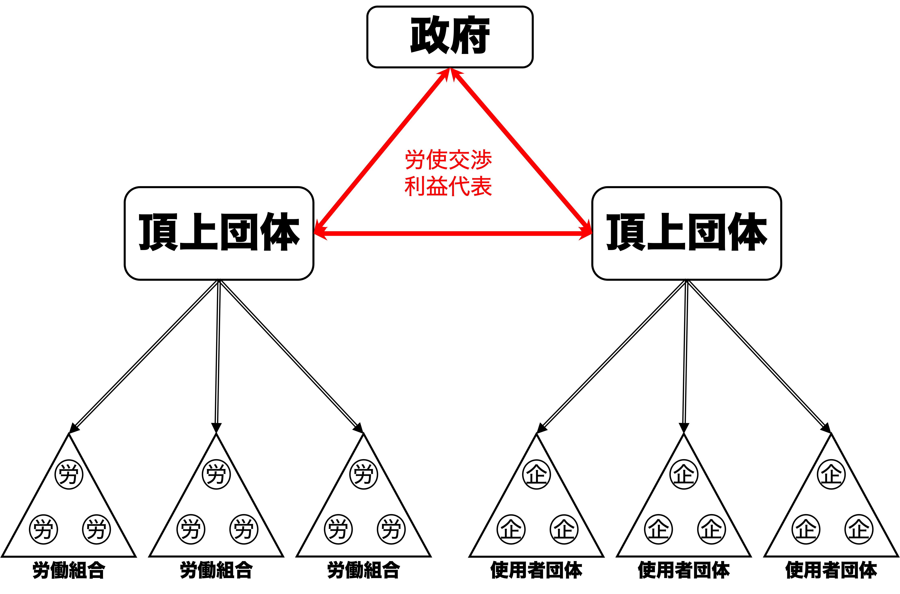

## 今日の目次

1. はじめに
1. コーポラティズム
1. 資本主義の多様性
1. 収斂仮説と資本主義
1. グローバル化と多様性
1. まとめ

# はじめに
::: {.notes}
目標15分
:::
## 先週のRPより
TBD

## 本日の目的と到達目標
#### 目的
各国の資本主義のあり方の違いを学ぶ。労使関係に着目したコーポラティズム論ともに、企業の視点にフォーカスした資本主義の多様性論を学ぶ。その上でグローバル化が資本主義のあり方にどのような影響を及ぼすのか、収斂仮説と多様性論の見地から議論する。

::: {.fragment .fade-in}
#### 到達目標
1. 多元主義とコーポラティズムの違いを説明できる。
1. 「資本主義の多様性論」に基づいて、自由型市場経済と調整型市場経済の違いを説明できる。
1. 収斂仮説に基づいて、グローバル化が資本主義のあり方に与える影響を予測できる。
1. 資本主義の多様性論に基づいて、グローバル化によって資本主義の多様性が維持される理由を説明できる。

:::

## 本日の授業の位置付け

# コーポラティズム
## クイズ
以下の文章のうち、北欧の社会民主主義福祉国家モデルの特徴に当てはまるのはどれか。当てはまるものすべてを選んでください。

1. 福祉給付の水準が全般的に高い。
1. 水準の異なる複数の給付システムが併存しており、社会的な格差が大きい。
1. 強力な労働組合が存在し、政治的にも影響力を有している。
1. 福祉給付は貧しい人だけに集中して行われる傾向にある。

## 労使関係 (industrial relations)
**労働者**と**使用者**（企業など）の関係

::: {.incremental}
- 政府の経済運営とマクロ経済実績に影響
- **フィリップ・シュミッター**の**ネオ・コーポラティズム論**以降、政治経済学で重要な議論に
   - 現在の酪農業界と[ファシスト・イタリアのCorporativismo](https://www.quaritch.com/books/fascism/ordinamento-corporativo-dello-stato-fascista/PO13/)の類似から着想

:::

## 多元主義 (pluralism)
{.r-stretch}

::: {.notes}
多元主義…英語圏で見られる労使関係のあり方

- 労働組合や使用者団体への加入は自由
- 労働者と使用者、組合と団体は個々に交渉
- 労働者と使用者は個々に政府に働きかけ
:::

## コーポラティズム (corporatism)
{.r-stretch}

::: {.notes}
**コーポラティズム** (corporatism)…大陸ヨーロッパ諸国で見られる労使関係のあり方

- フィリップ・シュミッターの提唱
  - ファシスト・イタリアのCorporativismo
  - 砂糖業界の新聞記事から着想
- **強制的メンバーシップ**…労働組合・業界団体への加入が強制
- **頂上団体** (peak association/national centre)…全国の労組あるいは使用者団体を統括する組織
   - 労組や企業は産業別の団体に加盟
   - 産業別団体は頂上団体に加盟
   - 頂上団体から下部組織は明確な指揮命令系統
- **公的な性格**をもつ団体交渉…頂上団体同士の交渉を政府が仲立ち

:::

## コーポラティズムの経済実績
::: {.fragment .fade-in} 
1970年代の**スタグフレーション**

::: {.incremental}
- stagnation (停滞) + inflation (インフレ)
- 1973年オイルショックによる悪化
:::
:::

::: {.fragment .fade-in}
コーポラティズム諸国の良好な経済実績

::: {.incremental}
- 英語圏→高い失業率とインフレ率
- 一部欧州→低い失業率とインフレ率
:::
:::

::: {.fragment .fade-in}
#### **囚人のジレンマ**
各個人が自分にとって最適な行動を行なった結果、全体としては最適な結果にならない状況

::: {.incremental}
- 個人的には賃金上昇が嬉しいが、社会的には望ましくない
- コーポラティズムが調整・緩和

:::
:::

# 資本主義の多様性
## Think-pair-share
日本とアメリカの経済のあり方について、どのような違いがあると思いますか。

例：例：雇用、労働環境、会社経営、企業間関係、政府の役割

## 資本主義の多様性
#### Varieties of Capitalism (VoC)
ピーター・ホールとデイヴィッド・ソスキスの提唱[^hall2001]

::: {.incremental}
- **企業**に焦点を当てた**アクター中心論**
   - コーポラティズム論は労働者に焦点
- 企業が直面する**情報の非対称性**
   - 取引における情報量の格差
   - 労働者、投資先、取引先…
- 対処の仕方に応じて2つの市場経済
   - **自由型市場経済**…アメリカやイギリスなどの英語圏
   - **調整型市場経済**…ドイツなど大陸欧州

:::

[^hall2001]: Hall, Peter A., Soskice, David (eds.): *Varieties of Capitalism. The Institutional Foundations of Comparative Advantage.* Oxford: Oxford University Press, 2001.

## 2つの市場経済 {.smaller}
|          | 自由型市場経済 (Liberal Market Economies: LMEs) | 調整型市場経済 (Coordinated Market Economies: CMEs) | 
| -------- | -------------------------------------------------- | ------------------------------------------------------ | 
| **原則**     | 市場原理の徹底                                     | 非市場メカニズムによる補完                             | 
| **労使関係** | 流動的                                             | 固定的                                                 | 
| **資金調達** | 直接金融（株式市場中心）                           | 間接金融（銀行融資中心）                               | 
| **企業統治** | トップダウン                                       | ボトムアップ                                           | 
| **教育制度** | 統合的                                             | [分離的](https://www.mext.go.jp/b_menu/shingi/chousa/shougai/015/siryo/08102203/001/016/004.htm)                                                 | 

## 制度的比較優位
LMEsとCMEsで得意な産業に差

::: {.incremental}
- LMEs…**抜本的イノベーション**に強み
   - 機動的な資源配分が可能
   - 例：バイオテクノロジー、IT、半導体
- CMEs…**漸進的な改善**に強み
   - 長期的な視点に立った資源配分が可能
   - 例：自動車や機械など製造業

:::

# 収斂仮説と資本主義
## Think-pair-share
収斂仮説に基づくと、グローバル化によって資本主義のあり方はどのように変化すると思いますか。

## 収斂仮説の予想
CMEsはLMEsに収斂してゆく

::: {.incremental}
- 雇用関係の流動化
   - 新人を育成する費用は高い
   - 集権的交渉で賃金が硬直的に
   →即戦力採用へのシフトや海外移転
- 企業統治の変化
   - 金融の国際化→出資者の交渉力増大
   - →労組の影響力排除、トップダウン経営へ
- 資金調達の変化
   - 資金調達も直接金融に
   - →情報開示の厳格化

:::

## ハルツ改革（Hartz Reforms）
::: {.colmuns}
::: {.column width=70%}
ドイツの**ゲアハルト・シュレーダー政権**（1998〜2005）で行われた労働市場改革

::: {.incremental}
- 背景：欧州統合、ユーロ導入、新興国の台頭
- 内容：
   - 派遣労働・解雇規制緩和
   - パートタイム雇用の促進
   - 失業給付の厳格化

:::
:::

::: {.column width=30%}

:::

:::
  
## 聖域なき構造改革
::: {.columns}
::: {.column width=70%}
**小泉純一郎**政権(2001〜2006)で行われた改革

::: {.incremental}
- 背景：バブル崩壊後の長期低迷、不良債権処理、産業構造変化
- 内容：
   - 経済財政諮問会議の設置と主導
   - 民営化や規制改革、地方分権
   - 期限付き労働の対象拡大
   - 派遣労働の対象拡大

:::
:::

::: {.column width=30%}

:::

:::

# グローバル化と多様性
## 収斂仮説批判
収斂仮説はLMEsの優位性を示唆

::: {.incremental}
 - 「企業は生産コストの最小化を目指す」との前提
 - LMEsの方が生産コストの削減に有利

:::

::: {.fragment .fade-in}
ホールとソスキスは多様性は維持されると主張

::: {.incremental}
- そもそも制度的比較優位を捨てるのは合理的ではない
- 制度的補完性が制度の安定性をもたらす

:::
:::

## 制度的補完性
ある制度の存在が他の制度から得られる利得や効率性を増大させること

::: {.incremental}
- 例：CMEsにおける資金調達と労働市場
  - 長期的な視点に立った銀行融資→長い期間にわたって人を雇用可能に
  - 固定的な労使関係→長い目で見た技術蓄積が可能→短期的な投資よりも銀行融資が向く

:::

# まとめ
## 本日の目的と到達目標
#### 目的
各国の資本主義のあり方の違いを学ぶ。労使関係に着目したコーポラティズム論ともに、企業の視点にフォーカスした資本主義の多様性論を学ぶ。その上でグローバル化が資本主義のあり方にどのような影響を及ぼすのか、収斂仮説と多様性論の見地から議論する。

::: {.fragment .fade-in}
#### 到達目標
1. 多元主義とコーポラティズムの違いを説明できる。
1. 「資本主義の多様性論」に基づいて、自由型市場経済と調整型市場経済の違いを説明できる。
1. 収斂仮説に基づいて、グローバル化が資本主義のあり方に与える影響を予測できる。
1. 資本主義の多様性論に基づいて、グローバル化によって資本主義の多様性が維持される理由を説明できる。

:::

## 次回までに
#### 事後学習

 - 授業資料を見直し、目標到達をセルフチェック
 - Moodle上でのリアクションペーパー入力（木曜日まで）
