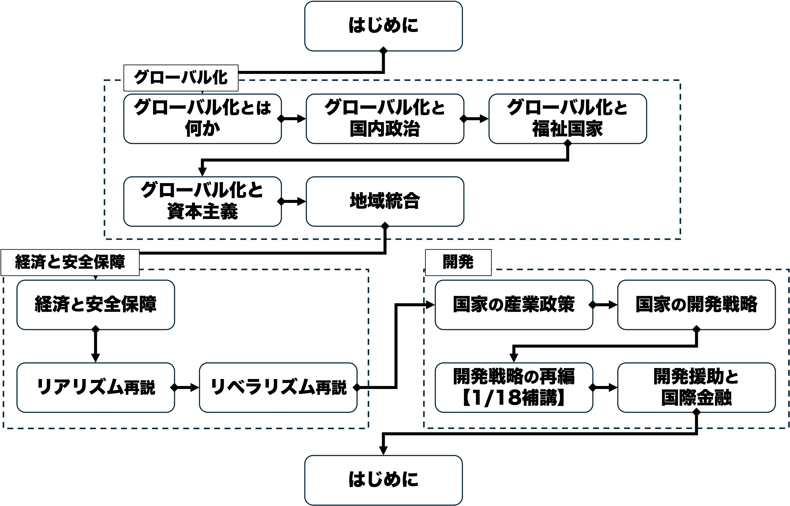
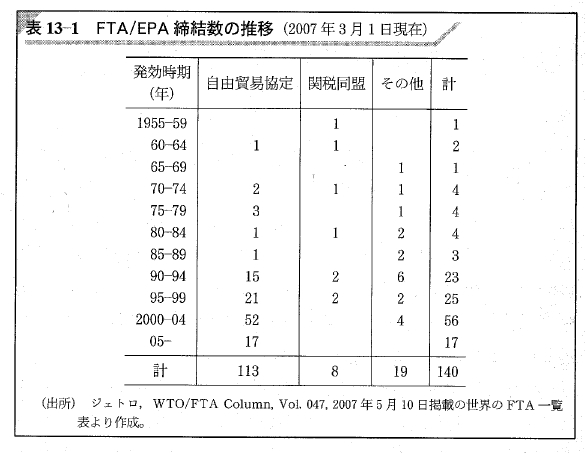
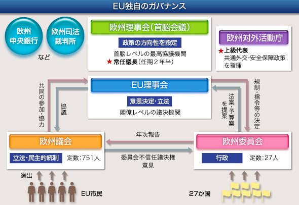
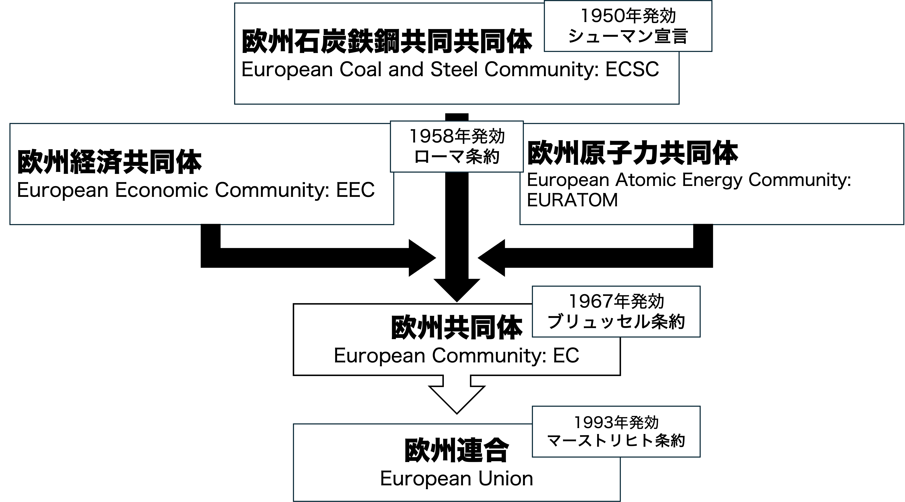

## 今日の目次

1. はじめに
1. 地域統合とその現況
1. 欧州連合
1. 欧州統合史
1. 欧州懐疑主義
1. まとめ

# はじめに
::: {.notes}
目標15分
:::
## 先週のRPより
TBD

## 本日の目的と到達目標
#### 目的
地域統合とは何か、その概念と現状を知るとともに、地域統合が最も進んだ例である欧州連合について学ぶ。欧州統合を機能主義の流れの中に位置付け、それに対する反発である欧州懐疑論の論理を理解する。

::: {.fragment .fade-in}
#### 到達目標
1. 地域化と地域主義の違いを説明できる。
1. 地域貿易協定のGATT＝WTO体制上の位置付けを説明できる。
1. 欧州連合の機構と主要政策を説明できる。
1. 欧州統合の歴史について、機能主義の視点から描写できる。
1. 欧州懐疑主義が挙げるEUに対する批判を4つ以上列挙できる。

:::

## 本日の授業の位置付け

# 地域統合とその現況
## 地域統合の概念
::: {.fragment .fade-in}
#### 地域統合
ある地域内の近隣の国々が国境を超えて政治的・経済的なつながりを深めること

:::

::: {.fragment .fade-in}
#### 地域化
貿易や文化の伝播などの形をとる、地域内交流の「自然」な拡大・深化（[参考](https://www.tutor2u.net/economics/reference/globalisation-intra-regional-trade?srsltid=AU7gw4WFDIEIhvjGZBx14if3qv5CA0V5KDazgeoyQ-Sl9zaw1pj4WHCm)）

:::

::: {.fragment .fade-in}
#### 地域主義
地域内交流を拡大・進化させるために国家が他国と公式・半公式の合意を形成する動き

:::

## クイズ
以下の説明はそれぞれ地域化と地域主義どちらに当てはまると思いますか

1. 観光振興のために日本政府が中国人に対してビザを免除した。
1. ネパール人はまず隣国のインドに出稼ぎに行くようになる。
1. 日本と韓国のドラマがお互いでリメイクされるようになっている。
1. 日本と中国と韓国が投資促進のために合意した。

## 地域貿易協定
#### Regional Trade Agreement (RTA)
特定の国間で貿易の促進を図るための協定

::: {.fragment .fade-in}
#### 自由貿易協定 (Free Trade Agreement: FTA)
主に二国間で締結され、締約国間での貿易自由化を促進するための取り決め

::: {.incremental}
- Cf. **経済連携協定** (Economic Partnership Agreement: EPA)
- 日本はアメリカ、メキシコ、フィリピンなどと締結済み（[参考](https://www.mofa.go.jp/mofaj/gaiko/fta/index.html)）

:::
:::

::: {.fragment .fade-in}
#### 関税同盟 (Customs Union)
主に3カ国以上で締結され、締約国間での貿易の自由化に加えて第三国に対する共通関税を定めるもの

:::

## RTAの締結数の推移
{.r-stretch}

## RTAとGATT=WTO体制
::: {.incremental}
- GATT＝WTO体制の**最恵国待遇**…すべての国に対して無差別な待遇
- 地域貿易協定は原則の例外
  - 締結前よりも高度な対域外制限を導入しない（GATT第24条5項）
  - 域内貿易に対する制限は実質的に廃止
- 99年のシアトル閣僚会議やドーハラウンドの挫折がRTA増加の背景

:::

# 欧州連合
## 世界の地域経済共同体
{.r-stretch}

## EUの機構
{.r-stretch}

::: {.notes}
EUの機構（図を見せる）

- **欧州理事会**…各国首脳で構成される最高機関。議長は俗に「EU大統領」。
- **EU理事会**…EUの立法を共同担当。欧州理事会とは別。議題ごとに各国の関係閣僚で構成。
- **欧州議会**…EUの立法を共同担当。EU市民から直接選挙。
- **欧州委員会**…執行機関。委員長が実質的なEUのリーダー。
:::

## クイズ
次のうち、EUレベルで共通の制度・政策が存在するものはどれでしょうか。

1. 農業政策
1. 通貨政策
1. 国境管理
1. 外交・安全保障
1. 教育
1. 軍隊

## EUの3つの顔
::: {.incremental}
- **経済統合**
  - 経済通貨同盟…単一市場と共通通貨**ユーロ**
  - 共通農業政策…所得保障と農村振興
- **政治・司法統合**
  - **EU法**と**欧州司法裁判所**
  - **シェンゲン協定**と犯罪対策
- **政策協力**
  - **共通外交・安全保障政策**
  - **外務・安全保障政策上級代表**（EU外相）の設置

:::

## 経済通貨同盟
#### Economic and Monetary Union (EMU)
単一通貨**ユーロ**（Euro）…1999年11カ国で導入→2026年現在21カ国

::: {.fragment .fade-in}
#### 欧州中央銀行 (European Central Bank: ECB)
::: {.incremental}
- 94年欧州通貨機構設立→98年ECBに改組
- ユーロの発行と共通金融政策

:::
:::

::: {.fragment .fade-in}
#### マーストリヒト基準（Maastricht criteria）
::: {.incremental}
- ユーロ導入のための基準
- インフレ率、政府債務、為替レート、長期利率
:::
:::

# 欧州統合史
## 欧州統合の過程
{.r-stretch}

## 質問
なぜ欧州は、最初から「政治統合」ではなく、石炭と鉄鋼の共同管理を始めたのでしょうか？

## 機能主義
ある特定領域の協力から始めて、広範な国際機関の設立を目指すという考え

::: {.incremental}
- デイビッド・ミトラニー、エルンスト・ハース、カール・ドイッチュ

:::

::: {.fragment .fade-in}
#### スピルオーバー仮説
技術・経済分野の協力が政治にも波及していくとする考え

::: {.incremental}
- 例：万国郵便連合(1874年）、国連専門機関、欧州統合

:::
:::

# 欧州懐疑主義
## 質問
近年EUに対しては批判が投げかけられていますが、具体的にはどのような問題がEUにはあると思いますか。

## 欧州懐疑主義 (Euroscepticism)

欧州連合や欧州統合に対する批判的な態度

::: {.incremental}
- 国家主権の侵害…一部のEU法は国内法に優越
- 民主的正統性の不足…欧州議会のみが公選で、意思決定が複雑
- 官僚機構の肥大化…巨大で複雑な機関が並存
- 新自由主義的志向…経済統合を弱者救済に優先
- 加盟国間の力の不均衡…ドイツなど大国の意向に偏重
- 財政負担…自国の富が弱小国に使われる懸念

:::

## 欧州債務危機（2010年）
2007年以降の金融危機→財政の悪化

::: {.incremental}
- ギリシャの国家財政粉飾が発覚→国債価格の暴落

:::

::: {.fragment .fade-in}
EU／ユーロ圏レベルの支援

::: {.incremental}
- **トロイカ**…欧州委員会、欧州中央銀行、国際通貨基金
- 救済と引き換えに厳しい緊縮が要求

:::
:::

::: {.fragment .fade-in}
→国家主権・民主的正統性・新自由主義的志向の問題

:::

## 移民・難民危機
2015年前後からシリア内戦を背景に欧州へ難民申請者が急増

::: {.fragment .fade-in}
#### ダブリン規則 (Dublin Regulation)
難民審査は原則として最初の到着国の責任

::: {.incremental}
- 加盟国間での負担をめぐる対立
  - イタリアやギリシャへの負担集中
  - ドイツの受け入れ表明と国内の反発

:::
:::

::: {.fragment .fade-in}
→国家主権と負担分配の問題

:::

## ブレグジット（Brexit）
2016年国民投票で52%が離脱を支持→2020年に離脱を完了

::: {.fragment .fade-in}
離脱派の主張

::: {.incremental}
- 「コントロールを取り戻せ」（国家主権）
- 「EUへの送金の代わりにNHSへ」（費用負担）
- 「ブリュッセルの官僚たち」（官僚制）

:::
:::
# まとめ
## 本日の目的と到達目標
#### 目的
地域統合とは何か、その概念と現状を知るとともに、地域統合が最も進んだ例である欧州連合について学ぶ。欧州統合を機能主義の流れの中に位置付け、それに対する反発である欧州懐疑論の論理を理解する。

::: {.fragment .fade-in}
#### 到達目標
1. 地域化と地域主義の違いを説明できる。
1. 地域貿易協定のGATT＝WTO体制上の位置付けを説明できる。
1. 欧州連合の機構と主要政策を説明できる。
1. 欧州統合の歴史について、機能主義の視点から描写できる。
1. 欧州懐疑主義が挙げるEUに対する批判を4つ以上列挙できる。

:::

## 次回までに
#### 事後学習

 - 授業資料を見直し、目標到達をセルフチェック
 - Moodle上でのリアクションペーパー入力（木曜日まで）
